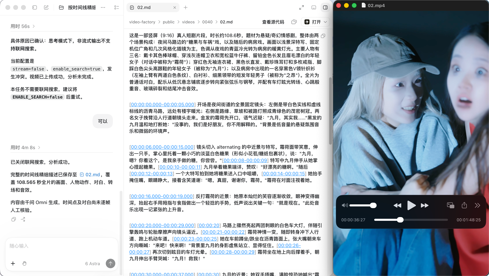
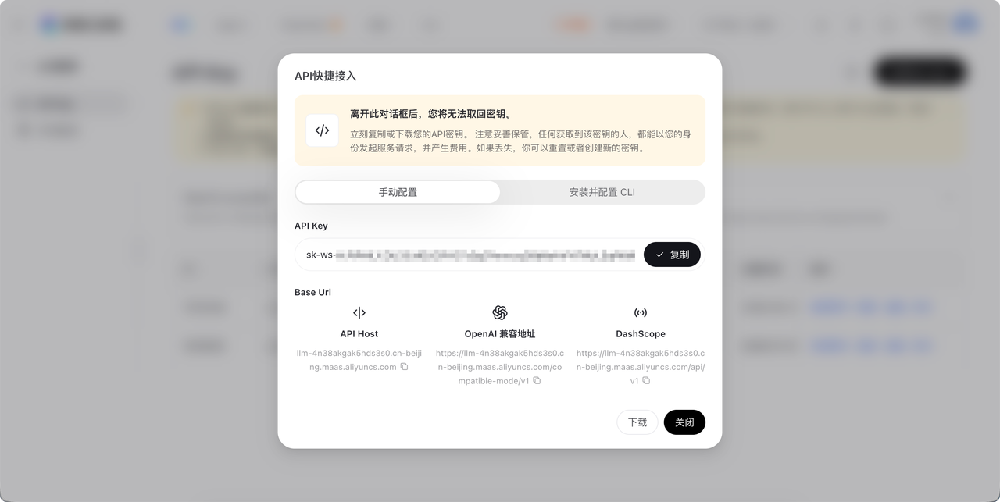
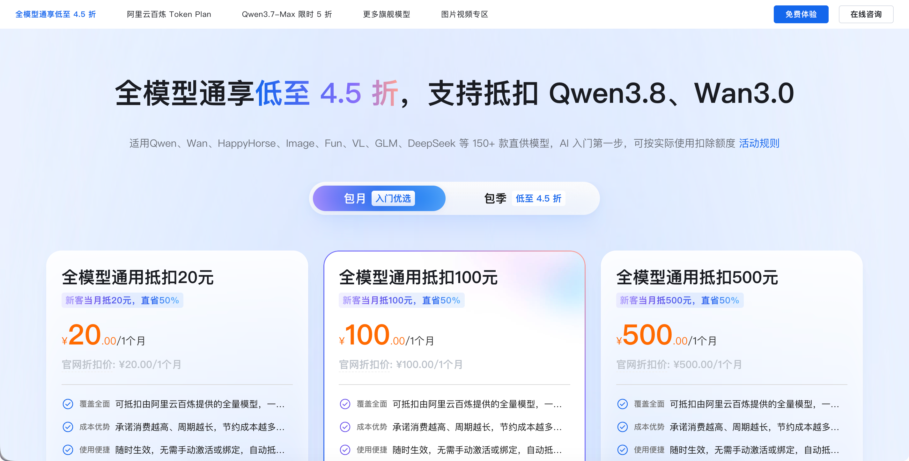

# 教程\-音视频理解 skill 安装配置

# 音视频理解 Skill

在 Agent 对话中指定本地音频或视频及任务，使用千问 Omni 分析，并将结果与原始资源元数据保存为 Markdown。支持音画描述、转写、多说话人分析、声音事件定位和自定义问答。



本文供首次安装、修改配置或排查问题时查看。日常任务流程在 [SKILL\.md](http://SKILL.md)，具体提示词按任务读取，不需要每次加载本文。

## 安装顺序

1. 下载 skill，放进所用 Agent 的技能目录。

2. 安装 Python 和 FFmpeg。

3. 为 Skill 创建运行环境，一次安装全部 Python 依赖。

4. 创建并填写 config\.env。

5. 让 Agent 加载 Skill，然后指定资源和任务开始使用。

已有可用依赖可以复用，但安装依赖和运行脚本必须使用同一个 Python 环境。

## 下载 skill

将文件夹放到你使用的 Agent 支持的技能目录；具体位置以该 Agent 的说明为准。

先确定最终目录，再创建下文的 \.venv。\.venv 是此 Skill 专用的 Python 环境，里面保存所需组件；创建后不要直接搬到另一台电脑或其他路径。在新位置重新执行依赖安装即可。

## 安装必要程序

|程序或组件|为什么需要|如何安装|
|---|---|---|
|Python 3\.10 及以上（推荐 3\.12）|执行分析脚本|按下方系统步骤安装|
|FFmpeg 中的 ffprobe|读取文件时长、分辨率、帧率、音轨等元数据|按下方系统步骤安装 FFmpeg|
|requests|调用上传和模型接口|下一步统一安装|
|requests\-toolbelt|流式上传大文件，避免一次把整个视频读进内存|下一步统一安装|
|jsonschema|检查结构化分析结果的 JSON 格式|下一步统一安装|

不用逐个查找和安装后三项。下文的 python \-m pip install \. 会读取 pyproject\.toml，一次装齐它们及各自依赖。安装依赖需要联网，但不会上传音视频或调用模型。

### macOS

如果已有 Homebrew，在“终端”运行：

```Plain Text
brew install python@3.12 ffmpeg
```

没有 Homebrew 时，可先按 [Homebrew 官网](https://brew.sh/)安装说明操作，再运行上面的命令。也可以使用 [Python 官网安装包](https://www.python.org/downloads/)和 [FFmpeg 官方下载页](https://ffmpeg.org/download.html)列出的 macOS 构建；需确保 ffprobe 能从终端运行。

### Windows

在 PowerShell 中运行（系统需提供 winget）：

```Plain Text
winget install --id Python.Python.3.12 --exact
winget install --id Gyan.FFmpeg --exact
```

若提示找不到 winget，可通过 Microsoft Store 的“应用安装程序”获取，或使用 [Python 官网安装包](https://www.python.org/downloads/windows/)与 [FFmpeg 下载页](https://ffmpeg.org/download.html)列出的 Windows 构建。手动安装 FFmpeg 时，将包含 ffprobe\.exe 的 bin 目录加入系统 PATH。

安装后重新打开终端；如果 Agent 之前已经在运行，也重新启动它，让其取得更新后的 PATH。

## 一次装齐 Python 依赖

打开终端，用 cd 进入刚放好的 Skill 文件夹。将示例路径替换成自己的实际位置；路径含空格时保留引号。

### macOS

```Plain Text
cd "/实际路径/qwen-omni-av-understanding"
python3.12 -m venv .venv
.venv/bin/python -m pip install --upgrade pip
.venv/bin/python -m pip install .
```

### Windows PowerShell

```Plain Text
cd "C:\实际路径\qwen-omni-av-understanding"
py -3.12 -m venv .venv
.\.venv\Scripts\python.exe -m pip install --upgrade pip
.\.venv\Scripts\python.exe -m pip install .
```

最后一个命令末尾的 \. 不能省略，表示“按当前目录的 pyproject\.toml 安装”。无需执行环境激活脚本。后续必须使用同一 \.venv 里的 Python，不能随意换成系统 python，否则仍可能提示缺少 jsonschema 等组件。

### pyproject\.toml 是什么？

它是运行依赖清单，声明 Python 版本及需要安装的组件，普通用户无需修改。当前安装方式依赖它，请保留。

删除它不会立刻卸载已经装好的组件，但新用户、换电脑或重建环境时，pip install \. 将无法按当前方式安装。若未来要改用 requirements\.txt，应同步迁移依赖清单和安装命令，不能直接删除。

## 创建并填写配置

在同一 Skill 目录下执行一次：

macOS：

```Plain Text
.venv/bin/python scripts/omni_av.py --init-config
```

Windows PowerShell：

```Plain Text
.\.venv\Scripts\python.exe scripts\omni_av.py --init-config
```

也可手动复制 config\.env\.example 并重命名为 config\.env。已有 config\.env 时直接编辑，不要重新初始化或覆盖原有设置。

用文本编辑器打开 config\.env。每行是 KEY=VALUE，无需设置系统环境变量；保存为 UTF\-8 文本，Windows 注意不要误存成 config\.env\.txt。注释单独写一行，路径可用引号包住，Windows 反斜杠不用加倍。

### DASHSCOPE\_API\_KEY 怎么获取？

必须填写 DASHSCOPE\_API\_KEY，并确认 DASHSCOPE\_BASE\_URL 与 API Key 的地域一致，并确认该地域已开通目标模型。

Key 可从阿里云百炼控制台获取，参考这个文档[获取与配置 API Key](https://help.aliyun.com/zh/model-studio/get-api-key?source=5176.29345612&userCode=ydhcon4a)。



让 AI 帮助安装时，Key 仍只填入本地配置文件，不需要发到聊天中。

### 如何获取模型额度？

新用户免费送 100 万 token。

新用户有一次 4\.5 折充值优惠，优先用这个[新一代基座大模型 Qwen3\.8\-Max 重磅发布](https://www.aliyun.com/benefit/scene/ai-discount#_Savingplan?source=5176.29345612&userCode=ydhcon4a)。



token plan 目前不支持多模态模型，不要搞错了。

### 模型地址和上传地址怎么填？

这两个地址用途不同：

- DASHSCOPE\_BASE\_URL：调用模型的基础地址。

- DASHSCOPE\_UPLOAD\_POLICY\_URL：向 DashScope **申请临时上传凭证**的 API 地址。不是你购买的 OSS Bucket 地址，也不是上传完成后的视频 URL。

脚本收到凭证后会自动取得真正的上传位置，上传原文件并取得 oss:// 引用，再发送给模型。用户不需要手动上传或复制视频 URL。

**按 API Key 的地域选择下表地址，上传地址留空即可。** 不需要自己购买 OSS 或寻找上传服务器。

|API Key 地域|DASHSCOPE\_BASE\_URL|DASHSCOPE\_UPLOAD\_POLICY\_URL|
|---|---|---|
|北京|https://dashscope\.aliyuncs\.com/compatible\-mode/v1|留空|
|新加坡|https://dashscope\-intl\.aliyuncs\.com/compatible\-mode/v1|留空|

北京地域配置示例：

```Plain Text
DASHSCOPE_API_KEY=在自己的配置文件填写真实Key
DASHSCOPE_BASE_URL=https://dashscope.aliyuncs.com/compatible-mode/v1
DASHSCOPE_UPLOAD_POLICY_URL=
OMNI_MODEL=qwen3.8-omni-flash
```

脚本分别自动使用 [https://dashscope\.aliyuncs\.com/api/v1/uploads](https://dashscope.aliyuncs.com/api/v1/uploads) 或 [https://dashscope\-intl\.aliyuncs\.com/api/v1/uploads](https://dashscope-intl.aliyuncs.com/api/v1/uploads) 申请凭证。也可显式填写对应地址，效果相同。这两个地域不能随意互换；模型是否可用以该地域的服务和账号权限为准。

[官方兼容接口文档](https://help.aliyun.com/zh/model-studio/qwen-api-via-openai-chat-completions)说明公共域名仍可正常使用，因此本安装流程不要求配置业务空间专属地址。其他地域或代理不在自动匹配范围内；上传凭证地址配置项仅保留作高级覆盖，不能用猜测的地址填写。

### 其他常用配置

|配置|默认值与含义|
|---|---|
|OMNI\_MODEL|qwen3\.8\-omni\-flash；切换型号需兼容现有上传、媒体与调用参数|
|STREAM|false，非流式；设为 true 后仍等待完整结果再写文件|
|REASONING\_EFFORT|medium，开启思考；none 关闭；空值使用模型默认值|
|ENABLE\_SEARCH|false；思考模式下非流式不支持联网搜索。需联网搜索时，同时将 STREAM=true|
|SEARCH\_STRATEGY|agent|
|MAX\_TOKENS|65536，最大输出长度；不是输入预算|
|OUTPUT\_DIR|留空输出到源文件目录；也可填统一结果目录|
|VIDEO\_FPS|2，服务端采样帧率；高动态任务可按需调整，最大 15|
|VIDEO\_MAX\_PIXELS|留空使用服务默认值，不进行本地压缩|
|TEMPERATURE / TOP\_P|留空使用服务默认值；不同思考模式可能不支持某些设置|
|UPLOAD\_TIMEOUT|60 秒，申请凭证等待时间；文件传输使用至少 1800 秒超时|
|REQUEST\_TIMEOUT|1800 秒，模型连接/读取等待时间，不是整个任务总时限|

OUTPUT\_DIR 可以写 "D:\\音视频分析结果" 或 "/Users/你的用户名/Documents/音视频分析结果"。相对路径按配置文件所在目录解析。改配置后下一次脚本启动生效，不必重装。

## 正式使用

按所用 Agent 的规则重新加载技能或开始新会话，然后发送任务，例如：

> 请用这个 Skill 分析“/路径/演示\.mp4”，按时间顺序详细描述操作过程，结果保存为 Markdown。
> 
> 

默认生成同目录的 演示\.md，含原始路径、时长和分析结果；视频另含分辨率、画面比例、帧率及音轨信息。已有同名结果时不自动覆盖；仅用户明确要求替换时允许覆盖。

单文件最大 1GB（1,000,000,000 字节），视频最长 1 小时，音频最长 2 小时。多个文件分别调用。原文件通过临时存储发送，不自动抽帧、切割、转码或把媒体 Base64 写进对话。

临时文件约 48 小时后自动清理，当前没有主动删除操作。上传凭证可能给出更低的单文件限额；主账号每日上传容量由服务端限制，不是无限空间。

## 常见问题

### 提示 No module named jsonschema / requests\_toolbelt

先确认是否执行了第 3 步的 pip install \. 且成功结束，再确认运行脚本用的是同一 \.venv 下的 Python。把包装到系统 Python、却用虚拟环境运行，或反过来，都会报缺少模块。

在 Skill 目录重新执行下列安装命令即可补齐，不用逐个安装：

- macOS：\.venv/bin/python \-m pip install \.

- Windows：\.\\\.venv\\Scripts\\python\.exe \-m pip install \.

### 提示找不到 ffprobe

FFmpeg 尚未安装，或者 Agent 没有取得更新后的 PATH。安装 FFmpeg，确认终端能运行 ffprobe \-version，再重启 Agent。安装 Python 依赖不会自动安装 FFmpeg。

### 提示无法推断上传地址

按上表选用与 API Key 地域一致的公共模型地址，并清空 DASHSCOPE\_UPLOAD\_POLICY\_URL。报错本身不能证明账号或 Key 有问题。

### 配置组合的提前校验

脚本在上传前检查已知的参数组合，发现冲突会直接停止，不会先上传文件：

- REASONING\_EFFORT 不是 none、STREAM=false、ENABLE\_SEARCH=true：思考模式下非流式不支持联网搜索。默认已设为 ENABLE\_SEARCH=false；如果确实要搜索，请同时开启流式。

- 使用 qwen3\.8\-omni\-flash 开启联网搜索时，SEARCH\_STRATEGY 必须为 agent。

- reasoning\_effort 与 thinking\_budget 不能同时设置。本 Skill 没有 thinking\_budget 配置项，避免了这类冲突。

模型、地域、媒体编码和服务端额度仍只能由服务端最终判断；脚本会把返回的错误码和原因显示出来。

### 上传成功，但分析返回 HTTP 400

上传成功只说明文件已存入临时存储，不代表模型接受了分析请求。

脚本会输出失败阶段、HTTP 状态、服务端错误码、原因、请求 ID（服务端有返回时），以及不含提示词和媒体的调用参数摘要。

不会打印完整响应、请求正文或媒体 Base64；错误字段中的常见密钥和媒体地址也会被遮蔽。

先查看具体“错误码”和“原因”，再只修改相关配置：

- 提示模型不存在或不可用：核对 OMNI\_MODEL、Key 地域和模型权限。

- 提示不支持某个参数或取值：按该型号文档调整对应配置，例如思考强度、搜索、流式或输出长度，不要同时乱改所有参数。

- 提示媒体无法访问或解析：检查临时文件有效期、上传与推理的模型及账号是否一致，以及实际媒体编码是否受支持。通过本地大小和时长校验不代表云端一定能解码。

- 提示输入过长：文件大小合规仍可能超过模型输入预算，需缩短媒体或调整服务端视频采样设置；脚本不自动切割。

### 其他请求和结果错误

|提示|处理方式|
|---|---|
|HTTP 401|检查 Key 是否有效，以及与地址地域是否匹配|
|HTTP 403|按服务端原因检查模型开通、账号权限或资源访问权限|
|HTTP 404|检查模型名和接口地址路径|
|HTTP 413|检查服务端或网关的请求/文件大小限制|
|HTTP 429|区分请求限流和配额不足，按具体原因处理|
|余额不足或服务欠费|以服务端错误码为准检查账单；不保证固定返回某个 HTTP 状态|
|HTTP 5xx|服务端或网关异常，保留请求 ID，必要时联系服务方|
|连接失败、超时|检查网络、DNS 和代理；分析阶段断线不能证明服务端未执行或未计费|
|TLS 证书校验失败|检查系统时间、证书和代理，不要关闭证书验证|
|非 JSON、缺少字段或流式中断|检查接口/代理兼容性；不将不完整响应写成正式结果|
|finish\_reason=length|输出达到上限，按模型支持范围调整 MAX\_TOKENS 或缩小任务|
|finish\_reason=content\_filter|内容被服务拦截，按服务提示处理|
|结果 JSON/时间范围校验失败|模型输出不符合任务约束；未覆盖正式结果，也不自动付费修复|
|文件权限不足|检查源文件可读、目标目录可写及文件是否被占用|

### 安装命令提示找不到 pyproject\.toml 或项目不可安装

确认终端已经 cd 进入 Skill 文件夹，且下载的是完整目录、保留了 pyproject\.toml。pip install \. 的点指终端当前目录。

### 用其他电脑或移动目录后不能运行

重新在最终 Skill 位置创建 \.venv 并安装依赖，保留自己的配置文件。不要将旧 \.venv 当作可跨电脑复制的安装包。

## 让 AI 代为安装

可以把 README 与 Skill 目录交给 Agent，并说：

> 按 README 帮我安装这个 Skill：确认文件放置位置，检查 Python 和 ffprobe，创建专用环境并一次装齐依赖，再帮我确认模型和上传地址。我会自行填写 API Key。不要上传文件或调用模型，完成后告诉我如何开始使用。
> 
> 

## 维护者：文件职责与扩展

- SKILL\.md 只放日常执行流程、模式选择及结果要求。

- references/prompts/ 保存任务提示词和 Schema，按需读取。

- scripts/omni\_av\.py 负责文件校验、临时上传、单次模型调用、元数据与输出。

- config\.env\.example 是空 Key 模板，config\.env 是用户实际配置，不公开分发。

- pyproject\.toml 声明安装依赖，README 负责安装和配置解释。

增加 references/prompts/模式名\.md 后脚本会自动发现对应模式，再在 SKILL\.md 模式表补充适用任务和链接。

以下划线开头的文件为内部共用模板；新增结构化输出约束时同步更新结果校验。

结构化描述保持 Schema 字段名稳定，描述性内容用中文，原始台词与文字保留原文。

当前采用一文件一请求以便对应结果和定位失败；流式是请求的传输选项，多轮会话需要额外管理历史和媒体引用。

单文件限制是本 Skill 的使用约束，不代表模型所有输入能力的上限。

提示词与临时上传规则参考：[Omni 官方文档](https://help.aliyun.com/zh/model-studio/qwen-omni)、[临时上传文档](https://help.aliyun.com/zh/model-studio/get-temporary-file-url)。

## 联系作者

请备注：GitHub\+音视频理解。


